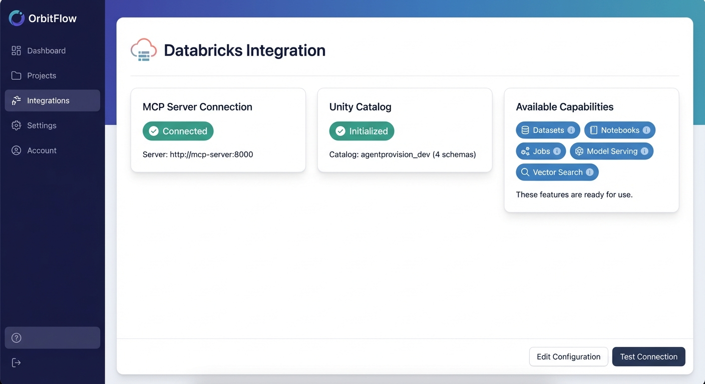

# AgentProvision: The Enterprise AI Orchestration Platform

[](https://agentprovision.com)
[](LICENSE)
[](docker-compose.yml)

AgentProvision is a comprehensive enterprise-grade platform that orchestrates AI agents, data pipelines, and analytics workloads in a unified lakehouse architecture. It enables organizations to deploy, manage, and scale AI agents across multi-cloud environments with full multi-tenant isolation.

## 🎯 Platform Overview

AgentProvision brings together data engineering, AI/ML, and business intelligence in a single cohesive platform:

- **🤖 Agent Orchestration**: Create and manage AI agent teams with hierarchical relationships and task delegation
- **🧠 Memory System**: Three-tier memory (Redis → Vector Store → Knowledge Graph) for persistent agent learning
- **🔄 Multi-LLM Router**: Smart routing across 5+ providers (OpenAI, Anthropic, DeepSeek, Google, Mistral) with cost optimization
- **🎨 Whitelabel System**: Complete branding customization with industry templates and feature flags
- **🏢 Enterprise Multi-Tenancy**: Full tenant isolation with JWT-secured APIs and per-tenant data segregation
- **⚡ Real-time Analytics**: Live dashboard with platform metrics, usage analytics, and AI-generated insights

## 🏗️ Architecture

```
┌─────────────────────────────────────────────────────────────┐
│                    FRONTEND (React)                          │
│  - Dashboard, Teams, Memory Explorer, LLM Config            │
│  - Bootstrap 5 UI, Mobile-responsive, i18n support           │
├─────────────────────────────────────────────────────────────┤
│                     API LAYER (FastAPI)                      │
│  - Auth, Chat, Workflows, Tool Executor, Analytics           │
│  - JWT security, Multi-tenant isolation, RESTful design     │
├─────────────────────────────────────────────────────────────┤
│                   MCP SERVER (FastMCP)                       │
│  - Databricks tools, Data integration, External connectors   │
│  - Model Context Protocol compliance                         │
├─────────────────────────────────────────────────────────────┤
│                      DATA LAYER                              │
│  - PostgreSQL (entities, knowledge graph)                    │
│  - Redis (hot context, message queues)                        │
│  - Vector Store (semantic memory)                            │
│  - Databricks Unity Catalog (Bronze/Silver/Gold layers)      │
└─────────────────────────────────────────────────────────────┘
```

## 🚀 Quick Start

### Prerequisites

- Docker and Docker Compose
- Node.js 18+ (for local web development)
- Python 3.11+ (for local API development)

### 1. Clone and Setup

```bash
git clone https://github.com/your-org/agentprovision.git
cd agentprovision
pnpm install
```

### 2. Environment Configuration

```bash
# Copy environment templates
cp .env.example .env
cp apps/api/.env.example apps/api/.env
cp apps/web/.env.local.example apps/web/.env.local

# Configure required settings
# - ANTHROPIC_API_KEY for Claude AI integration
# - DATABASE_URL for PostgreSQL connection
# - MCP_API_KEY for Databricks integration
```

### 3. Start Development Environment

```bash
# Start all services with custom ports to avoid conflicts
DB_PORT=8003 API_PORT=8001 WEB_PORT=8002 docker-compose up --build

# Services will be available at:
# - API: http://localhost:8001
# - Web: http://localhost:8002
# - Database: localhost:8003
# - Temporal UI: http://localhost:8233
```

### 4. Access the Platform

1. **Marketing Site**: http://localhost:8002
2. **Dashboard**: http://localhost:8002/dashboard
3. **Demo Login**: Use "Login as Demo User" or credentials:
   - Email: `test@example.com`
   - Password: `password`

## 📁 Repository Structure

```
agentprovision/
├── apps/
│   ├── api/                 # FastAPI backend (Python 3.11)
│   │   ├── app/
│   │   │   ├── api/v1/     # REST API endpoints
│   │   │   ├── models/     # SQLAlchemy data models
│   │   │   ├── services/   # Business logic layer
│   │   │   ├── workflows/  # Temporal workflow definitions
│   │   │   └── core/       # Configuration and security
│   │   ├── tests/          # API test suite
│   │   └── requirements.txt
│   ├── web/                # React SPA (JavaScript)
│   │   ├── src/
│   │   │   ├── components/ # React components
│   │   │   ├── pages/      # Route pages
│   │   │   ├── services/   # API client services
│   │   │   └── utils/      # Utility functions
│   │   ├── public/         # Static assets
│   │   └── package.json
│   └── mcp-server/         # Model Context Protocol server
│       ├── src/
│       │   ├── tools/      # MCP tools
│       │   ├── clients/    # External API clients
│       │   └── server.py   # MCP server implementation
│       └── tests/
├── docs/
│   ├── plans/              # Implementation plans and designs
│   ├── archive/            # Historical documentation
│   └── IMPLEMENTATION_VERIFICATION_REPORT.md
├── infra/
│   ├── docker/             # Docker container definitions
│   └── terraform/          # AWS infrastructure as code
├── scripts/
│   ├── deploy.sh           # Production deployment script
│   ├── e2e_test_production.sh
│   └── run_demo_workflow.sh
├── AGENTS.md               # Guidelines for agentic coding
├── CLAUDE.md               # Claude Code development guide
├── docker-compose.yml
├── package.json
└── README.md
```

## 🎨 Key Features with Visuals

### 1. Databricks Integration - Automatic Dataset Sync



AgentProvision automatically syncs your datasets to Databricks Unity Catalog with a medallion architecture:

- **✅ MCP Server Connection**: Real-time status monitoring
- **📊 Bronze Layer**: Raw data ingestion from uploads
- **🔄 Silver Layer**: Automated data cleaning and transformations
- **🏆 Gold Layer**: Business-ready analytics tables

**How it works:**
1. Upload a CSV/Parquet file via the UI
2. Temporal workflow triggers Bronze table creation
3. Automatic transformation to Silver layer with data quality checks
4. Query your data directly from the chat interface

```bash
# Example: Upload and sync a dataset
POST /api/v1/datasets/ingest
{
  "name": "sales_data",
  "file": "sales_q1_2025.csv"
}

# Response includes Databricks table locations
{
  "bronze_table": "catalog_dev.bronze.sales_data",
  "silver_table": "catalog_dev.silver.sales_data_clean",
  "row_count": 10245
}
```

### 2. Universal Chat Import & Knowledge Extraction

Import your chat histories from ChatGPT and Claude to build a knowledge base:

**Features:**
- 📥 **Import ChatGPT conversations.json** - Preserve your valuable AI interactions
- 📥 **Import Claude conversations.json** - Migrate your Claude chat history
- 🧠 **Automatic Knowledge Extraction** - Uses Temporal workflows to extract entities
- 🔗 **Knowledge Graph** - Visualize relationships between people, companies, and concepts

**Temporal Workflow Integration:**
- Knowledge extraction runs as a reliable background workflow
- Retry logic ensures no data is lost
- Monitor extraction progress in Temporal UI
- Extracted entities feed into agent context

```python
# Knowledge extraction workflow
@workflow.defn
class KnowledgeExtractionWorkflow:
    async def run(self, session_id: str, tenant_id: str):
        # Extract entities using LLM
        result = await workflow.execute_activity(
            extract_knowledge_from_session,
            args=[session_id, tenant_id],
            start_to_close_timeout=timedelta(minutes=5)
        )
        return result
```

### 3. Multi-LLM Router with Cost Optimization

Smart routing across 5+ LLM providers with automatic cost optimization:

| Provider  | Best For                | Cost/1M tokens | Speed    |
|-----------|-------------------------|----------------|----------|
| DeepSeek  | Code generation         | $0.14          | Fast     |
| Claude    | Complex reasoning       | $3.00          | Medium   |
| GPT-4o    | General tasks           | $2.50          | Fast     |
| Gemini    | Multimodal analysis     | $1.25          | Fast     |
| Mistral   | European compliance     | $2.00          | Medium   |

**Features:**
- 🎯 **Automatic Model Selection** - Based on task complexity and cost
- 💰 **Cost Tracking** - Real-time token usage and cost monitoring
- 🔄 **Fallback Logic** - Automatic failover if a provider is down
- ⚙️ **Per-Tenant Configuration** - Different models for different customers

### 4. Agent Teams & Hierarchical Delegation

Create sophisticated AI agent teams with defined roles and relationships:

```python
# Example: Sales Analytics Team
{
  "name": "Sales Analytics Team",
  "goal": "Analyze Q1 sales and generate executive report",
  "agents": [
    {
      "role": "Data Analyst",
      "capabilities": ["sql_query", "data_visualization"],
      "llm_config": "deepseek-chat"  # Cost-effective for data tasks
    },
    {
      "role": "Report Writer",
      "capabilities": ["summarization", "report_generation"],
      "llm_config": "claude-sonnet-4"  # High quality for writing
    },
    {
      "role": "Team Lead",
      "autonomy": "supervised",
      "max_delegation_depth": 2,
      "llm_config": "gpt-4o"  # Balanced for coordination
    }
  ]
}
```

**Delegation Flow:**
1. User asks: "Analyze Q1 sales performance"
2. Team Lead delegates to Data Analyst
3. Data Analyst queries dataset and creates visualizations
4. Report Writer generates executive summary
5. Team Lead reviews and delivers final report

### 5. Three-Tier Memory System

Persistent learning across conversations with intelligent memory retrieval:

```
┌─────────────────────────────────────────────────┐
│  HOT CONTEXT (Redis)                            │
│  - Active conversation messages                 │
│  - Session state and variables                  │
│  - Access time: <1ms                            │
└─────────────────────────────────────────────────┘
                    ↓
┌─────────────────────────────────────────────────┐
│  SEMANTIC MEMORY (Vector Store)                 │
│  - Past conversation embeddings                 │
│  - Similar experience retrieval                 │
│  - Access time: ~10ms                           │
└─────────────────────────────────────────────────┘
                    ↓
┌─────────────────────────────────────────────────┐
│  KNOWLEDGE GRAPH (PostgreSQL)                   │
│  - Entities: People, Companies, Concepts        │
│  - Relationships and facts                      │
│  - Access time: ~50ms                           │
└─────────────────────────────────────────────────┘
```

### 6. Whitelabel & Multi-Tenancy

Complete platform customization for each tenant:

**Branding:**
- 🎨 Custom colors, logos, and themes
- 🏷️ Custom AI assistant names
- 🌐 Custom domains (e.g., `acme.agentprovision.com`)
- 📱 Industry-specific templates (Finance, Healthcare, Retail)

**Feature Flags:**
```json
{
  "features": {
    "databricks_integration": true,
    "advanced_analytics": true,
    "custom_tools": false,
    "white_glove_support": true
  },
  "limits": {
    "max_agents": 50,
    "max_datasets": 100,
    "monthly_tokens": 10000000
  }
}
```

### 7. Real-Time Analytics Dashboard

Monitor platform usage and AI performance:

**Metrics Tracked:**
- 📊 **Usage**: Messages sent, tasks completed, tokens consumed
- 💰 **Costs**: Per-provider spending, cost per task
- 🤖 **Agent Performance**: Success rates, delegation patterns
- 📈 **Trends**: Daily/weekly/monthly comparisons
- 🎯 **AI Insights**: Automatically generated recommendations

**Example Insights:**
- "DeepSeek usage increased 40% this week, saving $2,400 in LLM costs"
- "Agent 'Data Analyst' has 95% task success rate, highest in team"
- "Dataset sync to Databricks averages 2.3 minutes for 10K rows"

## 🔧 Core Features

### Agent Orchestration

Create sophisticated AI agent teams with hierarchical relationships:

```python
# Agent teams with defined roles and relationships
agent_group = {
    "name": "Sales Analytics Team",
    "goal": "Analyze sales performance and generate insights",
    "agents": [
        {"role": "Data Analyst", "capabilities": ["sql_query", "visualization"]},
        {"role": "Report Writer", "capabilities": ["summarization", "report_generation"]},
        {"role": "Team Lead", "autonomy": "supervised", "max_delegation_depth": 2}
    ]
}
```

### Memory & Knowledge Graph

Three-tier memory system for persistent learning:

- **Hot Context** (Redis): Active conversation context, <1ms access
- **Semantic Memory** (Vector Store): Past experiences with embeddings, ~10ms access
- **Knowledge Graph** (PostgreSQL): Structured facts and relationships, ~50ms access

### Multi-LLM Intelligence

Smart routing across multiple providers with cost optimization:

| Provider  | Models                   | Use Case            | Cost/1K tokens |
| --------- | ------------------------ | ------------------- | -------------- |
| OpenAI    | GPT-4o, GPT-4o-mini      | General reasoning   | $2.50/$10.00   |
| Anthropic | Claude Sonnet 4, Haiku 4 | Complex analysis    | $3.00/$15.00   |
| DeepSeek  | DeepSeek Chat, Coder     | Cost-effective      | $0.14/$0.28    |
| Google    | Gemini 1.5 Pro/Flash     | Multimodal tasks    | $1.25/$5.00    |
| Mistral   | Mistral Large, Codestral | European deployment | $2.00/$6.00    |

### Databricks Integration

Automatic dataset synchronization with medallion architecture:

```bash
# Upload dataset → Auto-sync to Databricks
POST /api/v1/datasets/ingest
{
  "name": "Revenue Q1 2025",
  "records": [...]
}

# Sync status tracking
GET /api/v1/datasets/{id}/databricks/status
{
  "sync_status": "synced",
  "bronze_table": "catalog_tenant_xyz.bronze.revenue_q1_2025",
  "silver_table": "catalog_tenant_xyz.silver.revenue_q1_2025_clean"
}
```

## 🛠️ Development Commands

### API (Python)

```bash
cd apps/api
pip install -r requirements.txt
pytest                    # Run all tests
pytest tests/test_api.py  # Run single test file
pytest -v                 # Verbose output
ruff check app            # Lint code
```

### Web (React)

```bash
cd apps/web
npm install
npm test                  # Run tests in watch mode
npm test -- --ci          # Run tests once
npm test -- WizardStepper.test.js  # Run single test
npm run build             # Build for production
```

### Monorepo

```bash
pnpm install && pnpm build && pnpm lint
```

## 🧪 Testing

### End-to-End Tests

Production-grade E2E test suite with 22 test cases:

```bash
# Run against local environment
BASE_URL=http://localhost:8001 ./scripts/e2e_test_production.sh

# Run against production
./scripts/e2e_test_production.sh
```

### Integration Tests

```bash
# Start services for integration testing
docker-compose -f docker-compose.yml -p agentprovision-integration-tests up -d db redis api n8n

# Run integration tests
cd apps/api && pytest tests/test_integrations.py
```

## 🌐 Production Deployment

### Automated Deployment

The `deploy.sh` script handles complete production deployment:

```bash
# On production VM
./deploy.sh
```

**What the script does:**

1. ✅ Checks prerequisites (Docker, Compose, Nginx, Certbot)
2. ✅ Stops existing services and builds new containers
3. ✅ Starts services with fixed ports (API:8001, Web:8002, DB:8003)
4. ✅ Configures Nginx reverse proxy with SSL termination
5. ✅ Obtains/renews SSL certificate via Certbot
6. ✅ Runs health checks and waits for API readiness
7. ✅ Executes E2E test suite (fails deployment if tests fail)
8. ✅ Reports deployment status

### Production Architecture

```
Internet → Nginx (SSL termination) → Docker Services
                                        ├── API (Port 8001)
                                        ├── Web (Port 8002)
                                        ├── DB (Port 8003)
                                        ├── Temporal (Ports 7233/8233)
                                        └── MCP Server (Port 8085)
```

### Environment Variables

Key production environment variables:

```bash
# API Configuration
ANTHROPIC_API_KEY=sk-ant-api03-xxxxxxxx
SECRET_KEY=your-production-secret-key
DATABASE_URL=postgresql://user:pass@db:5432/agentprovision

# Databricks Integration
MCP_SERVER_URL=http://mcp-server:8085
MCP_API_KEY=your-production-mcp-key
DATABRICKS_SYNC_ENABLED=true
DATABRICKS_AUTO_SYNC=true

# Temporal Workflows
TEMPORAL_ADDRESS=temporal:7233
TEMPORAL_NAMESPACE=default
```

## 📊 Platform Capabilities

### Analytics Dashboard

Real-time platform metrics and AI-generated insights:

- **Usage Metrics**: Messages, tasks, tokens, costs by period
- **Agent Performance**: Success rates, delegation patterns, skill proficiency
- **Data Analytics**: Dataset sync status, query performance, storage usage
- **AI Insights**: Automatically generated recommendations and forecasts

### Whitelabel System

Complete tenant customization:

```python
tenant_branding = {
    "company_name": "Acme Corp",
    "primary_color": "#1f77b4",
    "ai_assistant_name": "Acme Assistant",
    "custom_domain": "acme.agentprovision.com",
    "industry": "finance",
    "compliance_mode": ["sox", "pci"]
}
```

### Tool Execution Framework

Extensible tool system for agents:

- **SQL Query Tool**: Execute read-only SQL queries on datasets
- **Calculator Tool**: Safe mathematical calculations
- **Data Summary Tool**: Statistical summaries and insights
- **Custom Tools**: Easy to add new tools via base class

## 📚 Documentation

### Core Documentation

- **[AGENTS.md](AGENTS.md)**: Guidelines for agentic coding agents
- **[CLAUDE.md](CLAUDE.md)**: Claude Code development guide
- **[LLM_INTEGRATION_README.md](LLM_INTEGRATION_README.md)**: Claude AI integration setup
- **[CONTEXT_MANAGEMENT_README.md](CONTEXT_MANAGEMENT_README.md)**: Conversation memory management
- **[TOOL_FRAMEWORK_README.md](TOOL_FRAMEWORK_README.md)**: Tool execution framework
- **[DATABRICKS_SYNC_README.md](DATABRICKS_SYNC_README.md)**: Databricks integration details

### Implementation Plans

See `docs/plans/` for detailed implementation documentation:

- **[Enterprise AI Platform Design](docs/plans/2025-11-25-enterprise-ai-platform-design.md)**
- **[Agent Orchestration Implementation](docs/plans/2025-11-25-phase1-agent-orchestration-implementation.md)**
- **[Memory System Implementation](docs/plans/2025-11-25-phase2-memory-system-implementation.md)**
- **[Multi-LLM Implementation](docs/plans/2025-11-25-phase3-multi-llm-implementation.md)**
- **[Whitelabel System Implementation](docs/plans/2025-11-25-phase4-whitelabel-system-implementation.md)**

## 🎯 Implementation Status

### ✅ Completed Features (100%)

- **Phase 1**: Agent Orchestration - Teams, hierarchies, task management
- **Phase 2**: Memory System - Three-tier memory with knowledge graph
- **Phase 3**: Multi-LLM Router - 5 providers with smart routing
- **Phase 4**: Whitelabel System - Branding, features, custom domains
- **Phase 5**: Full Integration - Chat with context and tools
- **Phase 6**: Multi-Provider LLM - Unified interface for all providers

### 🚧 In Progress

- Data source connection wizard (PostgreSQL, Google Sheets, Salesforce, REST API)
- Automated sync configuration for connected data sources

### 📋 Planned

- OAuth/SAML SSO integration (Okta, Azure AD)
- Evaluation dashboards with LangGraph visual editor
- OpenTelemetry observability with Grafana dashboards
- GitHub Actions CI/CD for automated deployments
- Incremental dataset sync and Gold layer transformations

## 🔍 API Reference

### Authentication

```bash
# Register tenant + admin user
POST /api/v1/auth/register
{
  "tenant_name": "Acme Corp",
  "admin_email": "admin@acme.com",
  "admin_password": "SecurePass!23"
}

# Login and get JWT token
POST /api/v1/auth/login
{
  "username": "admin@acme.com",
  "password": "SecurePass!23"
}
```

### Core Endpoints

All endpoints require `Authorization: Bearer <token>` header.

```bash
# Agent Management
GET /api/v1/agents                    # List agents
POST /api/v1/agents                   # Create agent
PUT /api/v1/agents/{id}               # Update agent

# Agent Teams
GET /api/v1/agent_groups              # List teams
POST /api/v1/agent_groups             # Create team

# Chat & Memory
GET /api/v1/chat/sessions             # List chat sessions
POST /api/v1/chat/sessions            # Create chat session
POST /api/v1/chat/sessions/{id}/messages  # Send message

# Datasets
GET /api/v1/datasets                  # List datasets
POST /api/v1/datasets/ingest          # Upload dataset
GET /api/v1/datasets/{id}/query       # Query dataset

# LLM Configuration
GET /api/v1/llm/providers             # List LLM providers
GET /api/v1/llm/models                # List available models
GET /api/v1/llm/configs               # List tenant configs
POST /api/v1/llm/configs              # Create LLM config
```

## 🤝 Contributing

### Development Workflow

1. **Fork** the repository
2. **Create** a feature branch: `git checkout -b feature/amazing-feature`
3. **Make** your changes following the [Code Style Guidelines](AGENTS.md)
4. **Test** your changes: `pnpm test && pnpm lint`
5. **Commit** your changes: `git commit -m 'Add amazing feature'`
6. **Push** to your branch: `git push origin feature/amazing-feature`
7. **Open** a Pull Request

### Code Style

- **Python**: Follow SQLAlchemy patterns, use Pydantic for validation, import order: stdlib → third-party → local
- **JavaScript**: React functional components with hooks, Bootstrap 5 UI, PascalCase components, camelCase services
- **Testing**: Write tests for all new features, ensure existing tests pass

## 📄 License

This project is licensed under the MIT License - see the [LICENSE](LICENSE) file for details.

## 🆘 Support

For support and questions:

- **Documentation**: See the comprehensive docs in this repository
- **Issues**: [GitHub Issues](https://github.com/your-org/agentprovision/issues)
- **Production Health**: Check `/health/live` and `/health/ready` endpoints
- **Monitoring**: Temporal UI at `http://localhost:8233` for workflow status

---

## 🎉 Ready to Get Started?

1. **Clone** the repository: `git clone https://github.com/your-org/agentprovision.git`
2. **Configure** your environment variables
3. **Start** the development environment: `docker-compose up --build`
4. **Access** the platform: http://localhost:8002
5. **Explore** the dashboard and create your first AI agent team!

**AgentProvision is production-ready and powering enterprise AI orchestration today.** 🚀
