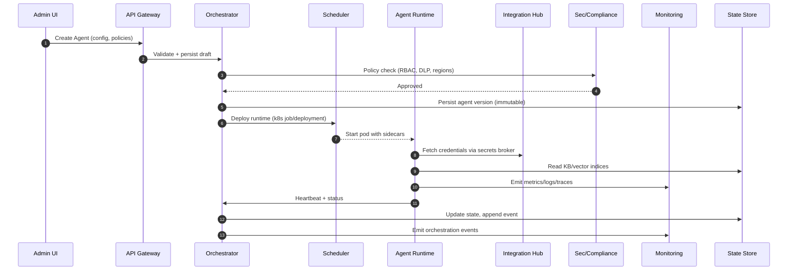

# AgentProvision: Enterprise Multi‑Agent SaaS Platform Architecture

> Version: 0.1 (Blueprint)

## Overview

AgentProvision is a multi‑tenant, cloud‑native platform to provision, operate, and govern specialized AI agents across enterprise organizations. It provides isolation by tenant, strong security and compliance, a standardized agent interface, and a pluggable integration hub for enterprise systems.

### High‑Level Architecture

```mermaid
flowchart TB
  subgraph Edge[Edge / Client]
    UI[Admin UI / Tenant Console]
    SDK[SDKs / CLI]
  end

  UI --> APIGW
  SDK --> APIGW

  subgraph Platform[AgentProvision Control Plane]
    APIGW[API Gateway & WAF]
    AuthN[AuthN/AuthZ Service]
    UM[User & Role Service]
    TM[Tenant Mgmt]
    Cat[Agent Catalog]
    Orchestrator[Agent Orchestration Service]
    Sched[Workload Scheduler]
    State[State & Metadata]
    Events[Event Bus]
    IntHub[Integration Hub]
    Sec[Security & Compliance]
    Billing[Billing & Usage]
    Obs[Monitoring & Analytics]
  end

  APIGW --> AuthN
  APIGW --> UM
  APIGW --> TM
  APIGW --> Orchestrator
  APIGW --> IntHub
  APIGW --> Billing

  Orchestrator <--> Sched
  Orchestrator <--> State
  Orchestrator <--> Events
  Orchestrator <--> Sec
  Orchestrator <--> Cat

  IntHub <--> Events
  IntHub <--> State
  Sec <--> Events
  Billing <--> Events
  Obs <--> Events

  subgraph DataPlane[Agent Data Plane]
    subgraph Runtime[Agent Runtimes (per tenant)]
      A1[Agent Pod(s)]
      A2[Agent Pod(s)]
      A3[Agent Pod(s)]
    end
    Vec[Vector DB / KB]
    Cache[Redis Cache]
  end

  Sched --> Runtime
  Runtime -->|telemetry| Obs
  Runtime <--> IntHub
  Runtime <--> Vec
  Runtime <--> Cache
```

## Core Services and Responsibilities

### API Gateway & Management
- Terminates TLS, enforces WAF/Rate limits, and routes to control‑plane services.
- Publishes a unified API surface (REST + GraphQL) and manages API keys per tenant and per integration.

### Authentication & Authorization
- Supports SSO (SAML/OIDC), SCIM for user/group provisioning, and per‑tenant IdP mapping.
- Enforces RBAC with resource‑scoped permissions and ABAC for fine‑grained policies.

### Tenant Management
- Lifecycle: create/suspend/delete tenants; plan/entitlements; region/DR policy.
- Isolation primitives: tenant org IDs, data partitioning, per‑tenant KMS keys, network policies.

### Agent Orchestration Service
- Lifecycle of agents: register, configure, deploy, pause/resume, retire.
- Task routing and model selection, retries, SLAs, and fallbacks between LLM providers.
- Maintains agent state machine and transitions; coordinates with Scheduler.

### Workload Scheduler
- Schedules agent pods/workflows onto Kubernetes with per‑tenant quotas and priority classes.
- Supports batch (jobs), streaming workers, and interactive agents.

### Integration Hub
- Prebuilt connectors (Jira, GitHub/GitLab, Slack, Confluence, AWS/GCP/Azure, Databricks, Snowflake, etc.).
- Normalized connector framework (pull/push, webhooks, polling, OAuth, secrets management).

### Security & Compliance Engine
- Centralized audit log, DLP, PII redaction, policy evaluation (OPA), compliance reports (SOC2, ISO 27001, GDPR, HIPAA option).
- Threat detection, anomaly detection, and guardrails for prompt/content filtering.

### Monitoring & Analytics
- Telemetry ingestion (metrics, logs, traces), SLO dashboards, usage analytics and cost allocation (per tenant/agent).

### Billing & Usage
- Tracks compute/runtime, LLM tokens, storage, egress; supports prepaid, postpaid, and custom enterprise contracts.

### State & Metadata Store
- Catalogs agents, versions, configs, secrets references, and operational states; event‑sourced where appropriate.

## Data Flow and State Management



### State Types
- Operational: agent instances, heartbeats, health, job status.
- Configuration: agent templates, policies, integration mappings (versioned).
- Secrets: stored via cloud secret managers, referenced by ID only.
- Knowledge: tenant KB (object storage) and embeddings in a vector DB.
- Audit: immutable append‑only store (WORM) for compliance.

## Deployment and Scaling Strategy

- Kubernetes as the control/data plane substrate with namespaces per tenant or pooled with strict labels and NetworkPolicies.
- Horizontal Pod Autoscaling by queue depth, token throughput, and latency SLOs.
- Multi‑region active‑active for control plane; active‑passive (or active‑active with CRDTs) for knowledge stores.
- Canary and blue/green for agent runtime and connector updates via GitOps.

## Key Platform Components (Detailed)

### Tenant Management System
- Data model: tenants, subscriptions, entitlements, regions, KMS key IDs, IdP config.
- APIs: create/suspend/resume; list users; set quotas; lifecycle webhooks.
- Isolation: row‑level security (RLS) + schema separation; per‑tenant encryption keys.

### Agent Orchestration Service
- Abstractions: AgentType, AgentTemplate, AgentInstance, Task, Capability, Tool, Policy.
- Routing: model router selects provider/model based on cost/SLA/quality; fallback trees; deterministic retries.
- Execution: orchestrates tool‑calls, streaming, interruptions, human‑in‑the‑loop checkpoints.

### Integration Hub
- Connector SDK: standardized interface (auth, schema, ops, events, health) with typed contracts.
- Execution model: out‑of‑process workers with sandboxing and timeouts.
- Secrets: managed via cloud secret stores (AWS Secrets Manager, GCP Secret Manager, Azure KeyVault).

### Security & Compliance Engine
- RBAC/ABAC with OPA policies; policy packs per framework (SOC2, ISO, GDPR, HIPAA).
- DLP/PII: classifiers, redactors; opt‑in tenant BYO DLP endpoints.
- Audit: append‑only logs shipped to SIEM (Splunk/Elastic) + long‑term archive.

### Monitoring & Analytics Platform
- Metrics: Prometheus; dashboards: Grafana; traces: OpenTelemetry + Tempo/Jaeger.
- Logs: Vector/Fluent Bit -> Elastic/OpenSearch; correlation IDs across requests/jobs.
- Analytics: Kafka topics -> warehouse (BigQuery/Snowflake) -> Looker/Metabase.

### Resource Management System
- Quotas: tokens/minute, jobs, CPU/memory/GPUs; priority classes per tenant/agent.
- Costing: per‑resource metering; chargeback/showback; anomaly detection.

### User Management & Authentication
- SSO (SAML/OIDC), SCIM; MFA; device posture policies via IdP; session management.
- Roles: platform admin, tenant admin, project admin, operator, viewer, auditor.

### Billing & Usage Tracking
- Metered dimensions: LLM tokens (prompt/completion), vector ops, storage GB‑days, egress GB, connector actions.
- Invoicing: Stripe for SMB; custom/EDI for enterprise; prepaid credits and burn‑down.

## Technology Stack Recommendation

- Cloud: AWS primary; abstractions compatible with GCP/Azure. Use managed KMS/Secret stores.
- Containers: Kubernetes (EKS/GKE/AKS), Karpenter/Cluster Autoscaler; Istio/Linkerd for mTLS.
- API: REST for control plane; GraphQL for UI aggregation; gRPC for internal services.
- Databases: PostgreSQL (metadata + RLS), Redis (caching/queues), S3/GCS (artifacts, KB), Vector DB (pgvector/Weaviate/Milvus).
- Messaging: Kafka (event bus, outbox), RabbitMQ or Redis Streams for short‑lived work queues.
- Observability: Prometheus/Grafana, OpenTelemetry, ELK/OpenSearch, Tempo/Jaeger.
- CI/CD: GitHub Actions or GitLab CI; Argo CD for GitOps; Argo Workflows for batch pipelines.

## Security & Compliance Architecture

- Multi‑tenant isolation: org_id everywhere; RLS and schema separation; per‑tenant KMS keys; network policies; dedicated runtime pools for high‑sensitivity tiers.
- Encryption: TLS 1.3 everywhere; AES‑256 at rest; envelope encryption with KMS; client‑side encryption option for KBs.
- Access Control: RBAC/ABAC; scoped API tokens; short‑lived worker tokens; JIT elevation with approval.
- Audit: immutable logs (WORM buckets); cryptographic hash chains; export to customer SIEM.
- Monitoring: threat detections, rate limiting, bot protection; model output guardrails.
- Compliance: policy packs and automated checks; data residency controls; DPIA support; breach workflows.

```mermaid
flowchart LR
  subgraph Security
    OPA[OPA Policy Engine]
    DLP[DLP/PII Service]
    AUD[Audit Log (WORM)]
    KMS[KMS/Secrets]
  end
  OPA-->APIGW
  OPA-->Orchestrator
  DLP-->APIGW
  DLP-->Runtime
  KMS-->Runtime
  AUD-->SIEM[(Tenant SIEM)]
```

## Agent Integration Framework

### Standardized Agent Interface (conceptual)

```typescript
// Pseudo‑types for the Agent SDK
interface AgentConfig {
  id: string; tenantId: string; version: string;
  capabilities: Capability[]; tools: ToolBinding[]; policies: PolicyRef[];
  modelHints?: ModelHints; kbRefs?: KBRef[];
}

interface AgentRuntime {
  onInit(ctx: AgentContext): Promise<void>;
  onEvent(evt: AgentEvent, ctx: AgentContext): Promise<AgentAction[]>;
  onTimer?(cron: string, ctx: AgentContext): Promise<AgentAction[]>;
  onShutdown?(ctx: AgentContext): Promise<void>;
}
```

### Lifecycle
- Draft -> Validated -> Deployed -> Running -> Paused -> Retired.
- Versioned, immutable configs; traffic splitting across versions for canaries.

### Resource Allocation and Scaling
- Runtime classes (cpu/mem/gpu); per‑agent autoscaling policies; token budgets enforced at gateway and runtime.

### Performance Monitoring
- Golden signals: latency, throughput, error rate, saturation; token utilization; queue depth.

### Error Handling and Recovery
- Retries with backoff and idempotency keys; DLQ for failed jobs; circuit breakers and timeouts.

### Version Control and Updates
- Config stored in Git; signed releases; SBOMs for runtimes; cosign image signing and admission policies.

## Enterprise Integration Capabilities

- SSO & Identity: OIDC/SAML, SCIM; role mapping; group‑based policies.
- API Management: global and per‑tenant rate limits; spike arrest; API keys/secrets rotation.
- Webhooks: signed, retry with backoff; event subscriptions by topic; replay with idempotency.
- Event‑Driven: Kafka with outbox pattern; CDC for metadata changes; schema registry.
- Custom Integrations: Connector SDK with local emulator; marketplace and private connectors.

## Monitoring & Observability

- Real‑time Metrics: Prometheus + multi‑tenant labeling; tenant dashboards.
- Resource Utilization: k8s metrics + cost exporter; per‑namespace cost allocation.
- Security Events: audit dashboards; anomaly alerts; webhook to customer SIEM.
- Compliance Validation: scheduled controls, evidence collection tasks, report generation.
- Cost Tracking: LLM token meter, storage/egress meters; optimization recommendations.
- Alert Management: Alertmanager; on‑call rotations; tenant‑scoped integrations (PagerDuty/Opsgenie).

## Scalability & Reliability

- Horizontal scaling at every tier; stateless services with sticky‑less routing; DB read replicas and sharding by tenant/region.
- Load balancing and failover via multi‑AZ, multi‑region, anycast DNS; graceful degradation paths.
- Data partitioning strategies: tenant‑hash sharding; region pinning; hybrid BYO‑VPC for private data sources.
- Caching: Redis for hot metadata; CDN for static assets; embedding cache with TTL + invalidation hooks.
- DR: RPO<=15m for metadata via cross‑region replication; RTO<=1h with infra as code; runbooks and chaos tests.

## Developer Experience

- APIs & SDKs: OpenAPI + GraphQL schemas; TypeScript/Python/Go SDKs; examples and sandboxes.
- Integration Dev Tools: local connector emulator; test harness with mocked SaaS APIs; contract tests.
- Testing: unit, contract, e2e (control plane), synthetic agents; load tests focused on token throughput.
- Automation: IaC (Terraform), GitOps (Argo CD), policy as code (OPA), supply chain (SLSA/SBOM).
- Debugging: trace‑first; correlation IDs in logs; redaction controls; secure log trails for auditors.

## Administrative Interface

- Tenant Dashboard: usage, costs, quotas, incidents; region/data residency settings.
- Agent Management: create/configure/deploy; version diff; traffic split; live metrics and logs.
- Users & Roles: SSO config; role templates; just‑in‑time access; access reviews.
- Integrations: connector catalog; credential vault; health and throttling; event subscriptions.
- Reporting: compliance posture; audit exports; SLA/SLO views; billing and invoices.

## Implementation Guidelines (MVP → GA)

1) MVP (Control Plane + First Agents)
- Services: APIGW, Auth, Tenant, Orchestrator, Scheduler, State (Postgres), Events (Kafka), Observability basics.
- Agents: two reference agents (DevOps, Documentation) with 3 connectors (GitHub, Jira, Slack).
- Security: SSO (OIDC), RBAC, basic audit, KMS, secrets rotation.
- Delivery: single region, multi‑AZ; IaC + GitOps; basic billing meter.

2) Hardening and Scale
- Add DLP/PII, OPA policies, WORM audit, BYO‑VPC access pattern, advanced quotas.
- Multi‑region control plane; DR tested; marketplace for connectors.
- Cost optimization: token router with price/SLA; caching of embeddings; vector store consolidation.

3) Enterprise Features
- SCIM, access reviews, evidence automation; private connectors; BYOK; data residency guarantees.
- Advanced analytics and usage forecasting; contract‑aware billing and credits.

## Example APIs (Sketch)

```yaml
# OpenAPI (fragment): Agent Orchestrator
paths:
  /v1/tenants/{tenantId}/agents:
    post: { summary: Create agent }
    get: { summary: List agents }
  /v1/tenants/{tenantId}/agents/{agentId}:
    get: { summary: Get agent }
    patch: { summary: Update agent }
  /v1/tenants/{tenantId}/agents/{agentId}:deploy:
    post: { summary: Deploy version }
```

```graphql
# GraphQL (fragment) used by Admin UI
type Agent { id: ID! name: String! version: String! status: String! }
type Query { agents(tenantId: ID!): [Agent!]! }
type Mutation {
  createAgent(input: AgentInput!, tenantId: ID!): Agent!
  deployAgent(agentId: ID!, version: String!): Deployment!
}
```

## Risk & Mitigations

- Model provider outages: multi‑provider router with health checks and failover; request replay from outbox.
- Cost blowouts: pre‑authorization, hard quotas, budget alerts, token pre‑estimates.
- Data leakage: DLP on ingress/egress; context windows curated; least‑privilege credentials per connector.
- Multi‑tenant noisy neighbors: quotas, priority classes, HPA/KEDA scaling, pod disruption budgets.

## Next Steps

- Finalize data model ERDs for Tenant/Agent/Policy/Usage.
- Draft OpenAPI/GraphQL schemas in `docs/api/` and generate SDKs.
- Scaffold control‑plane services and Helm charts.
- Define connector SDK and publish 2–3 reference connectors.
- Stand up observability stack and basic billing meters.

